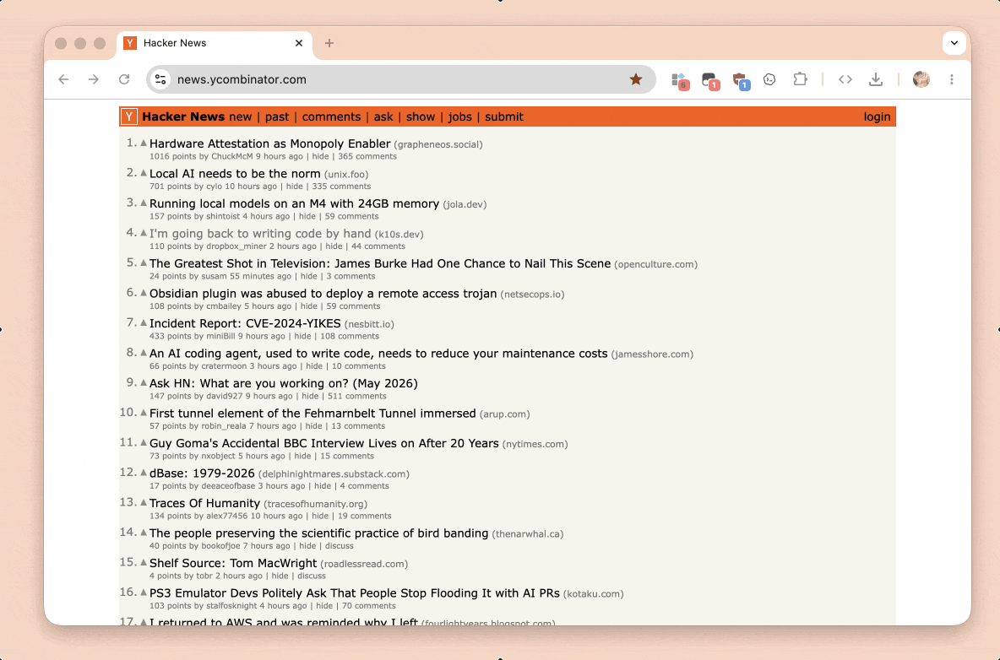

   

# 谷粒-Chrome插件英雄榜

🌈谷粒-Chrome插件英雄榜, 为优秀的Chrome插件写一本中文说明书, 让Chrome插件英雄们造福人类~
ChromeAppHeroes, Write a Chinese manual for the excellent Chrome plugin, let the Chrome plugin heroes benefit the human~

**感谢[老罗巴扎嘿](https://github.com/LuoJiangYong)为本项目设计的新的Logo | [谷粒文化(老罗巴扎嘿语录)](https://zhaoolee.com/ChromeAppHeroes/#/meaning_of_gu_li)**

谷粒-Chrome插件英雄榜使用**开源魔法文档工具[docsify](https://github.com/docsifyjs/docsify/)构建**, 托管在Github Pages, 完全开源!

**付费VPN科学上网工具推荐**:  通用网络加速器, 为科技工作者创造价值, 如果你想获得稳定高速的科学上网体验,zhaoolee推荐一家小众但非常稳定的VPN供应商GLaDOS(提供vmess方式)看Youtube1080P不卡,注册登录后, 后台提供iOS端美区APP的下载账号, [点击链接](https://glados.rocks/landing/OFQTF-AA9NU-I0JVK-11AY8) 可以获得的高速VPN体验 [http://i.v2fy.com/vpn](http://i.v2fy.com/vpn)

## 目录(点击以下标题, 可以进入文章页~)

- [133《Shift Translator Hover Toggle》调用Chrome自带的离线翻译API，沉浸式翻译的平替](https://zhaoolee.com/ChromeAppHeroes/#/133-shift-translator-hover-toggle.md)

- [132《Gemini NanoBanana Watermark Remover》提升AI生图幸福感！油猴脚本自动移除NanaBanana水印](https://zhaoolee.com/ChromeAppHeroes/#/132-gemini-nano-banana-watermark-remover.md)

- [131《uBlock Origin Lite》自动屏蔽油管贴脸广告😅，Chrome扩展工具进入MV3时代的去广告神器](https://zhaoolee.com/ChromeAppHeroes/#/131-ublock-origin-lite.md)

- [130《Get cookies.txt LOCALLY》 获取油管cookies，自动化下载油管视频](https://zhaoolee.com/ChromeAppHeroes/#/130-get-cookiestxt-locally.md)

- [129《YouTube Subtitle Downloader》下载Youtube视频的字幕，支持中英对照](https://zhaoolee.com/ChromeAppHeroes/#/129-youtube-subtitle-downloader.md)

- [128《Wayback Machine》优雅查看任意网页的历史记录](https://zhaoolee.com/ChromeAppHeroes/#/128-wayback-machine.md)

- [127《Z-Library Finder》优雅进入全球最大的Z-Library自由免费Free图书馆](https://zhaoolee.com/ChromeAppHeroes/#/127-z-library-finder.md)

- [126《File Management - WebDav》优雅使用浏览器通过WebDav上传下载管理自建网盘的文件](https://zhaoolee.com/ChromeAppHeroes/#/126-file-management-webdav.md)

- [125《Redirect Path》查看一个页面是如何跳转过来的](https://zhaoolee.com/ChromeAppHeroes/#/125-redirect-path.md)

- [124《HackerNews New Tab》自动使用新标签页打开Hacker News内容](https://zhaoolee.com/ChromeAppHeroes/#/124-hackernews-new-tab.md)

- [123《Language Learning with Netflix & YouTube-AFL》听原汁原味的读音，用奈飞Youtube双字幕学英语](https://zhaoolee.com/ChromeAppHeroes/#/123-language-learning-with-netflix-2024-03-16)

- [122《Video Screenshot》为奈飞Netflix精彩画面截图，壁纸爱好者必备神器](https://zhaoolee.com/ChromeAppHeroes/#/122-video-screenshot-2024-03-16)

- [121《Console Importer》在Chrome直接使用npm军火库, 在控制台动态展示一张猫猫图](https://zhaoolee.com/ChromeAppHeroes/#/121-console-importer-2023-12-20)

- [120《Wikiwand》提升维基百科的使用体验](https://zhaoolee.com/ChromeAppHeroes/#/120-wikiwand-2023-10-12)

- [119《InsPop》用英语经典语录原音学英语](https://zhaoolee.com/ChromeAppHeroes/#/119-inspop-2023-10-12)

- [118《Immersive Translate》沉浸式阅读英语的免费工具，模糊中文愉悦阅读英语文章](https://zhaoolee.com/ChromeAppHeroes/#/118-immersive-translate-2023-05-12)

- [117《ChatGPT HeartBeat》让ChatGPT Web服务保持连接，避免反复刷新ChatGPT Web版页面](https://zhaoolee.com/ChromeAppHeroes/#/117-chatgpt-heartbeat-2023-04-21)

- [116《EXIF Viewer Classic》查看网页中摄影图片的拍摄时间光圈快门等Exif参数信息](https://zhaoolee.com/ChromeAppHeroes/#/116-exif-viewer-classic-2022-10-22)

- [115《Linkclump》在网页画个长方形，打开长方形内所有超链接](https://zhaoolee.com/ChromeAppHeroes/#/115-linkclump-2022-10-22)

- [114《WordPress SideBar》为WordPress网站添加类似GitBook的侧边栏目录](https://zhaoolee.com/ChromeAppHeroes/#/114-wordpress-sidebar-2022-07-10)

- [113《SVG Export》将SVG矢量图导出为任意尺寸的PNG图片](https://zhaoolee.com/ChromeAppHeroes/#/113-svg-exprot-2022-05-05)

- [112《Smart TOC》节约滚动网页时间, 为任意网页自动添加索引，生成浮动智能小目录](https://zhaoolee.com/ChromeAppHeroes/#/112-smart-toc-2021-09-09)

- [111《Unsplash For Chrome》查找免费无版权超清图并直接插入任意在线编辑器](https://zhaoolee.com/ChromeAppHeroes/#/111-unsplash-for-chrome-2021-07-22)

- [110《微信公众号同步助手》快速将微信文章同步到知乎B站等创作平台](https://zhaoolee.com/ChromeAppHeroes/#/110-wechatsync-2021-06-13)

- [109《GLaDOS》一款快捷签到领魔法上网天数的小工具文章作者](https://zhaoolee.com/ChromeAppHeroes/#/109-glados-2021-06-09)

- [108《Grabox》打通Chrome，Edge，FireFox，360，2345，QQ，搜狗等浏览器们的书签目录](https://zhaoolee.com/ChromeAppHeroes/#/108-grabox-2021-06-08)

- [107《I don't care about cookies》屏蔽所有网站询问Cookies授权的弹窗](https://zhaoolee.com/ChromeAppHeroes/#/107-i-dont-care-about-cookies-2021-06-05)

- [106《Browser Desktop》一款MacOS风格的浏览器桌面](https://zhaoolee.com/ChromeAppHeroes/#/106-browser-desktop-2021-06-05)

- [105《潮汐》极简番茄钟与白噪音,和大自然一起，平静身心](https://zhaoolee.com/ChromeAppHeroes/#/105-tide-2021-05-29)

- [104《特别篇：星愿浏览器》下载一切可下载的视频](https://zhaoolee.com/ChromeAppHeroes/#/104-twinkstar-2021-05-17)

- [103《Marinara 番茄工作法（Pomodoro®）助理》奇妙番茄钟, 提醒打工人及时休息](https://zhaoolee.com/ChromeAppHeroes/#/103-marinara-2021-05-14)

- [102《特别篇：手机如何使用Chrome插件》手机端如何屏蔽知乎广告](https://zhaoolee.com/ChromeAppHeroes/#/102-mobile-2021-05-13)

- [101《Scroll To Top Button》一键滚动到页面顶部或底部](https://zhaoolee.com/ChromeAppHeroes/#/101-scroll-to-top-button-2021-05-13)

- [100《Volume master》完美控制每个网页的音量](https://zhaoolee.com/ChromeAppHeroes/#/100-volume-master-2021-03-25)

- [099《Get Favicon》一键获取网站的超清图标](https://zhaoolee.com/ChromeAppHeroes/#/099-get-favicon-2021-03-22)

- [098《RSSHub Radar》可以帮助你快速发现和订阅当前网站RSS的浏览器扩展](https://zhaoolee.com/ChromeAppHeroes/#/098-rsshub-radar-2021-03-02)

- [097《假装水墨屏》让网页内容变成水墨屏效果](https://zhaoolee.com/ChromeAppHeroes/#/097-fake-ink-screen-2021-02-27)

- [096《Feedbro》在Chrome中订阅RSS信息流](https://zhaoolee.com/ChromeAppHeroes/#/096-feedbro-2021-02-27)

- [095《JsonFormatter》轻量化Json开源格式化工具查看一言api接口字段数据结构](https://zhaoolee.com/ChromeAppHeroes/#/095-json-formatter-2021-02-18)

- [094《SmoothScroll》让网页滚动如奶油般顺滑的奇妙小工具](https://zhaoolee.com/ChromeAppHeroes/#/094-smoothscroll-2021-02-14)

- [093《Search to Play the Song》在浏览器中随时听我想听的歌~(周杰伦的也行)](https://zhaoolee.com/ChromeAppHeroes/#/093-sps-2021-02-09)

- [092《Copyfish 🐟 Free OCR Software》自动截图识别网页中的文字](https://zhaoolee.com/ChromeAppHeroes/#/092-copyfish-ocr-2021-02-08)

- [091《FasterChrome》鼠标悬停预加载链接让你的Chrome起飞](https://zhaoolee.com/ChromeAppHeroes/#/091-faster-chrome-2020-12-28)

- [090《拒绝二维码登录》让淘宝、京东、阿里云等网站默认使用账号密码登录](https://zhaoolee.com/ChromeAppHeroes/#/090-no-qr-login-2020-12-21)

- [089《本地YouTube下载器》实现被Google禁止的功能](https://zhaoolee.com/ChromeAppHeroes/#/089-youtube-2020-12-20)

- [088《知乎网页助手》让网页版知乎更好用](https://zhaoolee.com/ChromeAppHeroes/#/088-zhihu-2020-12-19)

- [087《豆瓣资源下载大师》1秒搞定豆瓣电影|音乐|图书下载](https://zhaoolee.com/ChromeAppHeroes/#/087-douban-2020-12-19)

- [086《CSDN开发助手》CSDN官方合法免广告工具,内含大量实用开发工具](https://zhaoolee.com/ChromeAppHeroes/#/086-csdn-2020-12-18)

- [085《nonstop》无感跳转到知乎，微博，简书，qq 邮箱等无法直接跳转的外链](https://zhaoolee.com/ChromeAppHeroes/#/085-nonstop-2020-12-15)

- [084《Web for TikTok》用Chrome刷海外版抖音TikTok，下载Tiktok短视频](https://zhaoolee.com/ChromeAppHeroes/#/084-tiktok-2020-11-07)

- [083《APK Downloader for Google Play Store》从谷歌商店获取apk安装包](https://zhaoolee.com/ChromeAppHeroes/#/083-apk-downloader-for-google-2020-11-02)

- [082《iGG谷歌访问助手》如何从Chrome商店下载扩展工具？](https://zhaoolee.com/ChromeAppHeroes/#/082-iguge-2020-11-02)

- [081《GitHub加速》提高中国开发者访问GitHub的速度](https://zhaoolee.com/ChromeAppHeroes/#/081-fast-github-2020-10-20)

- [080《小码短链接》免费为相同url生成多个永久短链接](https://zhaoolee.com/ChromeAppHeroes/#/080-xiaomark)

- [079《Search the current site(站内搜索)》超实用的站内搜索工具](https://zhaoolee.com/ChromeAppHeroes/#/079-search-the-current-site)

- [078《Bookmarks clean up》高效清理重复和损坏的书签](https://zhaoolee.com/ChromeAppHeroes/#/078-bookmarks-clean-up)

- [077《Sourcegraph》阮一峰大佬推荐的github仓库关键词搜索工具](https://zhaoolee.com/ChromeAppHeroes/#/077-sourcegraph)

- [076《Listen1》Chrome听付费歌曲工具！免费听周杰伦的歌，网易云音乐,QQ音乐,虾米音乐,酷狗,酷我,哔哩哔哩,咪咕,一个扩展全搞定](https://zhaoolee.com/ChromeAppHeroes/#/076-listen1)

- [075《Link to Text Fragment》这款谷歌发布的分享工具，让3万新媒体人直呼绝活儿…](https://zhaoolee.com/ChromeAppHeroes/#/075-link-to-text-fragment)

- [074《破解右键锁》如何自由复制百度文库网页内容?](https://zhaoolee.com/ChromeAppHeroes/#/074-enable-right-click)

- [073《Chrome Better History》如何让Chrome查找历史记录更方便?](https://zhaoolee.com/ChromeAppHeroes/#/073_chrome_better_history)

- [072《OneNote Web Clipper》微软免费跨平台笔记OneNote扩展程序](https://zhaoolee.com/ChromeAppHeroes/#/072_one_note_web_clipper)
- [071《Color Tab》色彩猎人优质配色提升你的审美](https://zhaoolee.com/ChromeAppHeroes/#/071_color_tab)
- [070《网盘助手》网盘万能钥匙,自定义提取码,获取文件下载直链](https://zhaoolee.com/ChromeAppHeroes/#/070_pan_zhushou)
- [069《ublock origin》免除优酷，腾讯，爱奇艺，YouTube视频广告](https://zhaoolee.com/ChromeAppHeroes/#/069_ublock_origin)
- [068《pakku 哔哩哔哩弹幕过滤器》提升你的哔哩哔哩弹幕体验](https://zhaoolee.com/ChromeAppHeroes/#/068_pakku)
- [067 《bilibili哔哩哔哩B站下载助手》下载在B站可以观看的视频](https://zhaoolee.com/ChromeAppHeroes/#/067_bilibili_downloader)
- [066 《PowerfulPixivDownloader》福利工具! Pixiv图片批量下载器](https://zhaoolee.com/ChromeAppHeroes/#/066_powerful_pixiv_downloader)
- [065 《HTML5视频截图器》精确截取每一帧视频,让蔡徐坤动起来](https://zhaoolee.com/ChromeAppHeroes/#/065_html5_jietu)
- [064《浮图秀》优雅查看B站视频封面](https://zhaoolee.com/ChromeAppHeroes/#/064_photoshow)
- [063《Picviewer CE+》功能丰富的网页看图神器](https://zhaoolee.com/ChromeAppHeroes/#/063_picviewer-ce)
- [062《彩云小译》一键实现网页中英文对照的翻译工具](https://zhaoolee.com/ChromeAppHeroes/#/062_caiyun)
- [061《ImageAssistant》图片助手批量图片下载器](https://zhaoolee.com/ChromeAppHeroes/#/061-image-assistant)
- [060《Tabagotchi》为减缓全球变暖做出贡献](https://zhaoolee.com/ChromeAppHeroes/#/060_tabagotchi)
- [059《PageSpeed Insight and CheckList》为网页优化提供建议和量化指标](https://zhaoolee.com/ChromeAppHeroes/#/059_page_speed_insight_and_check_list)
- [058《IP-Address》快速查看当前设备IP](https://zhaoolee.com/ChromeAppHeroes/#/058_ip_address) 
- [057《图片另存为JPG/PNG/WebP》让WebP图片下载为PNG格式](https://zhaoolee.com/ChromeAppHeroes/#/057_webp_save_as_png)
- [056《Search》为Chrome设置搜索引擎关键词](https://zhaoolee.com/ChromeAppHeroes/#/056_search)
- [055《Keylines》为网页元素添加随机描边颜色](https://zhaoolee.com/ChromeAppHeroes/#/055_keylines)
- [054《二箱 以图搜图》让你在搜图方面随心所欲（为所欲为）](https://zhaoolee.com/ChromeAppHeroes/#/054_er_xiang_yi_tu_sou_tu)
- [053《鼠标点击特效 (๑•́ ∀ •̀๑)》为鼠标点击添加有趣的特效](https://zhaoolee.com/ChromeAppHeroes/#/053_shu_biao_dian_ji_te_xiao)
- [052《Site Palette》自动提取网站配色](https://zhaoolee.com/ChromeAppHeroes/#/052_site_palette)

- [051《Custom Cursor for Chrome™》为Chrome换上可爱初音光标](https://zhaoolee.com/ChromeAppHeroes/#/051_custom_cursor_for_chrome)

- [050《Google Results Previewer》无点击查看谷歌搜索结果](https://zhaoolee.com/ChromeAppHeroes/#/050_google_results_previewer)

- [049《Web Server for Chrome》搭建本地Web服务器, 实现局域网共享文件夹](https://zhaoolee.com/ChromeAppHeroes/#/049_web_server_for_chrome)

- [048《Words Discoverer》高亮标注单词,提升你的词汇量](https://zhaoolee.com/ChromeAppHeroes/#/048_words_discoverer)

- [047《Go to Tab》快速跳转到打开的网页](https://zhaoolee.com/ChromeAppHeroes/#/047_go_to_tab)

- [046《WhatFont》字体爱好者优雅查看网页字体](https://zhaoolee.com/ChromeAppHeroes/#/046_whatfont)

- [045《Restlet Client》优秀的Api测试工具](https://zhaoolee.com/ChromeAppHeroes/#/045_restlet_client)

- [044《谷歌访问助手》访问Chrome商店 Gmail 谷歌搜索](https://zhaoolee.com/ChromeAppHeroes/#/044_gu_ge_fang_wen_zhu_shou)

- [043《Dream Afar New Tab》探索世界的新方式](https://zhaoolee.com/ChromeAppHeroes/#/043_dream_afar_new_tab)

- [042 在Edge中安装Chrome扩展程序](https://zhaoolee.com/ChromeAppHeroes/#/042_edge)

- [041《Copy All Urls》优雅地保存-开启多个标签页](https://zhaoolee.com/ChromeAppHeroes/#/041_copy_all_urls)

- [040《GitZip for github》从Github批量下载表情包](https://zhaoolee.com/ChromeAppHeroes/#/040_gitzip_for_github)

- [039《Simplify Gmail》让网页版Gmail更清爽](https://zhaoolee.com/ChromeAppHeroes/#/039_simplify_gmail)

- [038《Alexa Traffic Rank》一键查看网站全球排名](https://zhaoolee.com/ChromeAppHeroes/#/038_alexa_traffic_rank)

- [037《Saladict》谷歌!有道!我全都要! 聚合词典, 并行翻译](https://zhaoolee.com/ChromeAppHeroes/#/037_saladict)

- [036《Screen Shader》把网页调成暖色，你的眼睛会感谢你🙏](https://zhaoolee.com/ChromeAppHeroes/#/036_screen_shader)

- [035《Print Friendly & PDF》让你拥有最佳的打印阅读体验](https://zhaoolee.com/ChromeAppHeroes/#/035_print_friendly_and_pdf)

- [034《Astro Bot》用新标签页刷编程题](https://zhaoolee.com/ChromeAppHeroes/#/034_astro_bot)

- [033《一叶》在任意网页开启实时弹幕 聊天窗口 留言板](https://zhaoolee.com/ChromeAppHeroes/#/033_yi_ye)

- [032《Smallpdf》简单好用的线上PDF工具](https://zhaoolee.com/ChromeAppHeroes/#/032_smallpdf)

- [031《OneTab》把多个Tab转换为一个列表](https://zhaoolee.com/ChromeAppHeroes/#/031_onetab)

- [030《掘金》相信优质技术内容的力量](https://zhaoolee.com/ChromeAppHeroes/#/030_jue_jin)

- [029 《SimpRead》为任意网页开启阅读模式](https://zhaoolee.com/ChromeAppHeroes/#/029_simread)

- [028《AdBlock》Adblock自定义屏蔽简书广告](https://zhaoolee.com/ChromeAppHeroes/#/028_adblock)

- [027《Text》来自Chrome实验室的跨平台记事本](https://zhaoolee.com/ChromeAppHeroes/#/027_text)

- [026《Quickey Launcher》打开网站只需一键](https://zhaoolee.com/ChromeAppHeroes/#/026_quickey_launcher)

- [025《Console》Chrome自带好用的计算器](https://zhaoolee.com/ChromeAppHeroes/#/025_console)

- [024《Dark Reader》为任意网站启用夜间模式](https://zhaoolee.com/ChromeAppHeroes/#/024_dark_reader)

* [023《FireShot》一键滚动截屏整个网页](https://zhaoolee.com/ChromeAppHeroes/#/023_fireshot)

* [022《扩展管理器》管理你的Chrome扩展](https://zhaoolee.com/ChromeAppHeroes/#/022kuo_zhan_guan_li_qi)

* [021《哔哩哔哩助手》助你快速成为B站老司机](https://zhaoolee.com/ChromeAppHeroes/#/021_bi_li_bi_li_zhu_shou)

* [020《Boxel Rebound》“嗨到中毒”的弹跳小方块(附自制赛道分享方法)](https://zhaoolee.com/ChromeAppHeroes/#/020_boxel_rebound)

* [019《MEGA》网盘可以良心到什么程度? 试试MEGA吧!](https://zhaoolee.com/ChromeAppHeroes/#/019_mega)

* [018《Enhanced Github》从“冰柜”到“冰棍儿”,下载Github单个文件](https://zhaoolee.com/ChromeAppHeroes/#/018_enhanced_github)

* [017《新浪微博图床》本地Markdown编写更流畅, 新浪微博图床来帮忙](https://zhaoolee.com/ChromeAppHeroes/#/017_xin_lang_wei_bo_tu_chuang)

* [016《解除B站区域限制》查看进击的巨人第三季](https://zhaoolee.com/ChromeAppHeroes/#/016_jie_chu_b_zhan_qu_yu_xian_zhi)

* [015 《XPath Helper》完成Bing每日壁纸的小爬虫](https://zhaoolee.com/ChromeAppHeroes/#/015_xpath_helper)

* [014《超级马里奥游戏》Chrome变身小霸王](https://zhaoolee.com/ChromeAppHeroes/#/014_chao_ji_ma_li_ao_you_xi)

* [013《Quick QR》用二维码实现云粘贴](https://zhaoolee.com/ChromeAppHeroes/#/013_quick_qr)

* [012《OurStickys》Chrome特色网页便签纸](https://zhaoolee.com/ChromeAppHeroes/#/012_ourstickys)

* [011 《whatruns》一键分析网站技术栈](https://zhaoolee.com/ChromeAppHeroes/#/011_whatruns)

* [010《speedtest》网络测速插件speedtest](https://zhaoolee.com/ChromeAppHeroes/#/010_speedtest)

* [009《vimium》Chrome与vim双神器融合](https://zhaoolee.com/ChromeAppHeroes/#/009_vimium)

* [008《Chrome Cleaner Pro》为Chrome加速](https://zhaoolee.com/ChromeAppHeroes/#/008_chrome_cleaner_pro)

* [007《loom》 Chrome翻录网页视频神器](https://zhaoolee.com/ChromeAppHeroes/#/007_loom)

* [006《SimilarSites》 一键查找姊妹网站 SimilarSites](https://zhaoolee.com/ChromeAppHeroes/#/006_similarsites)

* [005《Video Speed Controller》 刷课（刷剧）神器！给网页视频加个速(最快可达16倍!)](https://zhaoolee.com/ChromeAppHeroes/#/005_video_speed_controller)

* [004《Tampermonkey》 油猴子! 给浏览器开个挂](https://zhaoolee.com/ChromeAppHeroes/#/004_tampermonkey)

* [003《Secure Shell App》 Chrome中开启ssh一种什么体验](https://zhaoolee.com/ChromeAppHeroes/#/003_secure_shell_app)

* [002《chrono》 让Chrome下载资源更容易](https://zhaoolee.com/ChromeAppHeroes/#/002_chrono)

* [001《markdown-here》 Markdown一键转换到"富文本格式"](https://zhaoolee.com/ChromeAppHeroes/#/001_markdown_here)

## 开源插件推广(作者自荐)

| 名称 | 作者主页 | 开源信息 | 简介 |
| -- | -- | -- | -- |
| [Make Zero](https://chrome.google.com/webstore/detail/make-zero-%E6%96%87%E5%AD%97%E5%8A%A0%E5%AF%86%E5%99%A8/ihpcojcdiclghnggnlkcinbmfpomefcc?hl=zh-CN) | [sheepzh](https://github.com/sheepzh) |  [Github仓库地址](https://github.com/sheepzh/make-zero) | 加解密文本 |
| [网费很贵](https://chrome.google.com/webstore/detail/%E7%BD%91%E8%B4%B9%E5%BE%88%E8%B4%B5-%E4%B8%8A%E7%BD%91%E6%97%B6%E9%97%B4%E7%BB%9F%E8%AE%A1/dkdhhcbjijekmneelocdllcldcpmekmm)  | [sheepzh](https://github.com/sheepzh) | [Github仓库地址](https://github.com/sheepzh/timer) | 统计网页的运行时间、用户的浏览时间和用户打开网站的次数 |
| [The Fucking Github](https://chrome.google.com/webstore/detail/the-fucking-github/agajobpbaphiohkbkjigcalebbfmofdo)| [lvxianchao](https://github.com/lvxianchao) | [Github仓库地址](https://github.com/lvxianchao/the-fucking-github) | 很方便地查看、整理、搜索你已经 Star 过的项目和搜索 Github 上的项目。 |
| [HitUP](https://chrome.google.com/webstore/detail/hitup/eiokaohkigpbonodjcbjpecbnccijkjb)| [wonderbeyond](https://github.com/wonderbeyond) | [Github仓库地址](https://github.com/wonderbeyond/HitUP) | 利用 New Tab “空白页” 助您保持对流行技术趋势的跟进，附带其它福利。 |
| [Gitako - Github file tree](https://chrome.google.com/webstore/detail/gitako-github-file-tree/giljefjcheohhamkjphiebfjnlphnokk)| [EnixCoda](https://github.com/EnixCoda) | [Github仓库地址](https://github.com/EnixCoda/Gitako) | 功能上类似于大名鼎鼎的 Octotree ，但是用了更现代化的前端工具，性能好很多。 |
| [GITHUBER](https://chrome.google.com/webstore/detail/githuber/janmcneaglgklfljjcpihkkomeghljnf)| [zhuowenli](https://github.com/zhuowenli) | [Github仓库地址](https://github.com/zhuowenli/githuber) | 这是一个帮助 GitHub 开发者每日发现优质内容的 Chrome 主页拓展。 |
| [GLaDOS](https://chrome.google.com/webstore/detail/glados/dhjjibbeddglobeoapgppnlnmijajfbb) | [glados-network](https://github.com/glados-network) | [Github 仓库地址](https://github.com/glados-network/GLaDOS) | GLaDOS is trustable networking manager, a system to master your network. |

### [133《Shift Translator Hover Toggle》调用Chrome自带的离线翻译API，沉浸式翻译的平替](https://zhaoolee.com/ChromeAppHeroes/#/133-shift-translator-hover-toggle.md)

大模型时代，垃圾信息满天飞，假新闻，假图片的制作成本越来越低，作为一个开发者，能从海外新闻找信息来源，读流畅阅读英文原版文档，可以让我们的认知更符合现实，不让道心蒙尘。

### [132《Gemini NanoBanana Watermark Remover》提升AI生图幸福感！油猴脚本自动移除NanaBanana水印](https://zhaoolee.com/ChromeAppHeroes/#/132-gemini-nano-banana-watermark-remover.md)

Gemini NanoBanana Watermark Remover 能帮我们无感移除水印，为我们省去去水印的时间，确实是能提高幸福感的小软件

### [131《uBlock Origin Lite》自动屏蔽油管贴脸广告😅，Chrome扩展工具进入MV3时代的去广告神器](https://zhaoolee.com/ChromeAppHeroes/#/131-ublock-origin-lite.md)

MV3 (新模式)： 谷歌为了“性能”和“隐私”理由（官方说法），引入了 declarativeNetRequest API。现在扩展程序不能实时拦截请求，必须预先向浏览器提交一份“静态过滤规则表”，由浏览器代为执行。这种改变剥夺了扩展程序的决策权，使得 uBO 标志性的“高级动态过滤”和实时脚本注入功能受到极大限制。如果你需要继续获得强大的广告拦截体验，安装 uBlock Origin Lite (uBOL)，这是原作者 Raymond Hill (gorhill) 专门为 MV3 架构开发的精简版。 符合 Chrome 新标准，无需特殊配置。

#### [130《Get cookies.txt LOCALLY》 获取油管cookies，自动化下载油管视频](https://zhaoolee.com/ChromeAppHeroes/#/130-get-cookiestxt-locally.md)

Cookies，是互联网时代最小的记忆单元。在上世纪九十年代，工程师 Lou Montulli 发明 Cookie，只为解决一个朴素的问题——让网页“记住”你是谁。

我们用《Get cookies.txt LOCALLY》导出油管 Cookie，只是为了让 youtube 能识别出我们的身份，这一刻，我们既在借助技术的力量突破下载的壁垒，也在复刻互联网最初的浪漫：在无状态的世界中，让程序认得你。

#### [129《YouTube Subtitle Downloader》下载Youtube视频的字幕，支持中英对照](https://zhaoolee.com/ChromeAppHeroes/#/129-youtube-subtitle-downloader.md)

Youtube 的精彩视频是极好的英语教材，里面包含了英语母语创作者最地道的表达，本文推荐一个可以快速下载纯英语字幕，以及中英对照字幕的插件，为英语学习者提供生动有趣的学习教材。

#### [128《Wayback Machine》优雅查看任意网页的历史记录](https://zhaoolee.com/ChromeAppHeroes/#/128-wayback-machine.md)

#### [127《Z-Library Finder》优雅进入全球最大的Z-Library自由免费Free图书馆](https://zhaoolee.com/ChromeAppHeroes/#/127-z-library-finder.md)

查找下载过程中，没有任何弹窗，点击即可下载，除了下载有点慢，没什么缺点，下载后的epub格式，可以被各类主流电子书软件打开，我个人比较喜欢Apple的Books，可以通过iCloud同步阅读进度。

#### [126《File Management - WebDav》优雅使用浏览器通过WebDav上传下载管理自建网盘的文件](https://zhaoolee.com/ChromeAppHeroes/#/126-file-management-webdav.md)

webdav与smb协议一样流行，在各大操作系统中被广泛支持，webdav基于http, 在不稳定的网络环境下表现更好，因为http协议本身就设计用于处理这种情况。在中国各类局域网的环境下，它可以轻松穿透防火墙，因为大多数防火墙默认允许HTTP/HTTPS流量。

#### [125《Redirect Path》查看一个页面是如何跳转过来的](https://zhaoolee.com/ChromeAppHeroes/#/125-redirect-path.md)

从巨量百应到抖音罗盘，中间有一个重定向页面，记录用户行为，同时完成两个平台联合授权登录的操作，作为一个开发者，如果我们需要获取这个记录页的信息，那Redirect Path是极好的工具

####  [124《HackerNews New Tab》自动使用新标签页打开Hacker News内容](https://zhaoolee.com/ChromeAppHeroes/#/124-hackernews-new-tab.md)

HackerNews每天都会展示大量高质量的内容索引，但是每次点击任意索引，当前的HackerNews页面就会被覆盖，而HackerNews New Tab 这款扩展工具，可以让我们自动使用新标签页打开索引，我个人感觉这样非常舒服，推荐给大家。

#### [123《Language Learning with Netflix & YouTube-AFL》听原汁原味的读音，用奈飞Youtube双字幕学英语](https://zhaoolee.com/ChromeAppHeroes/#/123-language-learning-with-netflix-2024-03-16)

用 Netflix 这种平台学英语，能听到原汁原味的英语读音，配合剧情，也不会感觉无聊，而且配合提词器可以精听，算得上性价比超高的学习方式。

#### [122《Video Screenshot》为奈飞Netflix精彩画面截图，壁纸爱好者必备神器](https://zhaoolee.com/ChromeAppHeroes/#/122-video-screenshot-2024-03-16)

Netflix有很多优质节目，遇到精彩的画面，如果使用截屏，Netflix就会自动黑屏，这里推荐一个适用于Web版可以对Netflix截图的小工具，安装工具后，Netflix的播放器底部会出现一个小相机图标，点击即可自动自动截取当前画面，并下载到本地

#### [121《Console Importer》在Chrome直接使用npm军火库, 在控制台动态展示一张猫猫图](https://zhaoolee.com/ChromeAppHeroes/#/121-console-importer-2023-12-20)

一个很不错的开发者扩展程序《Console Importer》， 让javascript程序员们，可以直接在浏览器快速安装各种好用的npm依赖包（npm包的丰富程度堪称军火库），并进行编程。

《Console Importer》会让Web工程师感觉很爽，但项目本身还有一些需要完善的点，我认为作者可以添加卸载npm包的功能，对于国内的程序员而言，允许设置npm软件源也是刚需。

#### [120《Wikiwand》提升维基百科的使用体验](https://zhaoolee.com/ChromeAppHeroes/#/120-wikiwand-2023-10-12)

Wikiwand是经典的设计向工具，Wiki的官方网页设计朴实，数据开源，Wikiwand基于Wiki已有的数据进行了页面优化，相当于增强主题，给用户更好的阅读体验，如果用户使用Wikiwand页面进行长时间浏览, Wikiwand还能获得很好的SEO，Wikiwand这个产品属于站在了巨人的肩膀上。

####  [119《InsPop》用英语经典语录原音学英语](https://zhaoolee.com/ChromeAppHeroes/#/119-inspop-2023-10-12)

InsPop收录各种经典电影，电视剧，纪录片经典语录的中英文释义，原版音频，配上精美海报，每次打开浏览器新Tab，能看到经典句子以及海报，利用碎片化时间无痛学英语。

#### [118《Immersive Translate》沉浸式阅读英语的免费工具，模糊中文愉悦阅读英语文章](https://zhaoolee.com/ChromeAppHeroes/#/118-immersive-translate-2023-05-12)

Immersive Translate 是学习英语的好工具，开启中文模糊化处理后，能让用户无障碍地零成本阅读大量互联网文章，寓教于乐，学练一体。

#### [117《ChatGPT HeartBeat》让ChatGPT Web服务保持连接，避免反复刷新ChatGPT Web版页面](https://zhaoolee.com/ChromeAppHeroes/#/117-chatgpt-heartbeat-2023-04-21)

ChatGPT HeartBeat 这个油猴脚本，可以每隔30秒（具体的秒数可以自定义），请求 `_ssgManifest.js` 文件， 原理类似服务器ssh连接登录服务器的心跳包，向服务器表明，用户仍在活跃，不要断开连接

####  [116《EXIF Viewer Classic》查看网页中摄影图片的拍摄时间光圈快门等Exif参数信息](https://zhaoolee.com/ChromeAppHeroes/#/116-exif-viewer-classic-2022-10-22)

《EXIF Viewer Classic》并不会对所有网页图片进行处理，只有当用户的手柄浮动到照片之上，才会试试读取图片Exif信息，并以文字浮层的形式，展示到照片顶部，如果照片包含GPS信息，会出现一个GPS红色标识，点击红色标识，会在Google 地图中展示出地点。

#### [115《Linkclump》在网页画个长方形，打开长方形内所有超链接](https://zhaoolee.com/ChromeAppHeroes/#/115-linkclump-2022-10-22)

Linkclump是一款很酷的小工具，开源地址 https://github.com/benblack86/linkclump ，Linkclump能让用户以更少的时间浏览更多的网页，非常适合高强度上网冲浪的新媒体工作者。

#### [114《WordPress SideBar》为WordPress网站添加类似GitBook的侧边栏目录](https://zhaoolee.com/ChromeAppHeroes/#/114-wordpress-sidebar-2022-07-10)

对于个人博客而言, GitBook的侧边栏文章目录, 非常适合广大读者阅读, 于是zhaoolee研究了一下WordPress的开放api接口, 然后写了个工具, 可以使用纯前端的方式, 以WordPress标准Api获取数据, 构建一个类似GitBook的侧边目录;

#### [113《SVG Export》将SVG矢量图导出为任意尺寸的PNG图片](https://zhaoolee.com/ChromeAppHeroes/#/113-svg-exprot-2022-05-05)

SVG非常适合作为品牌Logo, 因为无论放大多少倍, 都不会失真, 而在制作PPT或Word的过程中, 往往需要PNG格式的图片, 《SVG Export》这款扩展程序,可以将网页上的SVG矢量图导出为任意尺寸的PNG图片.

#### [112《Smart TOC》节约滚动网页时间, 为任意网页自动添加索引，生成浮动智能小目录](https://zhaoolee.com/ChromeAppHeroes/#/112-smart-toc-2021-09-09)

####  [111《Unsplash For Chrome》查找免费无版权超清图并直接插入任意在线编辑器](https://zhaoolee.com/ChromeAppHeroes/#/111-unsplash-for-chrome-2021-07-22)

随着自媒体的兴趣, 内容创造者数量也越来越多, 而一张好图片, 能极大提升读者的观感. 

在互联网时代, 并非所有的图片都需要付费使用, 但乱用图片产生的版权纠纷, 的确会非常麻烦.

Unsplash这款扩展程序, 的确提升了用户查找和使用无版权图片的效率, 值得一试~ 

#### [110《微信公众号同步助手》快速将微信文章同步到知乎B站等创作平台](https://zhaoolee.com/ChromeAppHeroes/#/110-wechatsync-2021-06-13)

微信公众号的内容，无法被大多数搜索引擎爬取，希望《微信公众号同步助手》工具，能让更多的内容创作者，把内容分发到整个互联网，为内容获得更多曝光的同时，也能让后来人能够在互联网轻松搜索自己需要的资源。

####  [109《GLaDOS》一款快捷签到领魔法上网天数的小工具文章作者](https://zhaoolee.com/ChromeAppHeroes/#/109-glados-2021-06-09)

GLaDOS是一款很稳定的魔法上网工具，支持Clash，iOS，Wireguard VPN， Surge客户端，路由器OpenWRT/LEDE and Padavan，V2Ray，Switch下载加速，配合GLaDOS插件，可以快捷白嫖服务天数，并能防失联。可以通过 http://i.v2fy.com/vpn 用QQ邮箱或Gmail邮箱注册体验

#### [108《Grabox》打通Chrome，Edge，FireFox，360，2345，QQ，搜狗等浏览器们的书签目录](https://zhaoolee.com/ChromeAppHeroes/#/108-grabox-2021-06-08)

每次安装启用一个新的浏览器，新浏览器都会建议用户把Chrome浏览器的书签导入到新浏览器中，但这种导入方式，始终无法实现双向同步，在Edge中添加的书签， 无法在Chrome中找到，也无法通过各家厂商的云服务同步，而Grabox的出现，彻底解决了跨浏览器同步书签的问题，是真正解决用户痛点的产品。

#### [107《I don't care about cookies》屏蔽所有网站询问Cookies授权的弹窗](https://zhaoolee.com/ChromeAppHeroes/#/107-i-dont-care-about-cookies-2021-06-05)

用户并不关心Cookies是否被使用， 网站弹窗询问用户是否使用Cookies，那这个网站摆明了就是要收集用户在本网站的浏览记录，这种弹窗直接通过《I don't care about cookies》屏蔽就好～

#### [106《Browser Desktop》一款MacOS风格的浏览器桌面](https://zhaoolee.com/ChromeAppHeroes/#/106-browser-desktop-2021-06-05)

MacOS的壁纸确实赏心悦目，Browser Desktop 让Windows用户和Linux用户，也能轻易体验MacOS壁纸带来的美感。

#### [105《潮汐》极简番茄钟与白噪音,和大自然一起，平静身心](https://zhaoolee.com/ChromeAppHeroes/#/105-tide-2021-05-29)

工作时, 听魔性音乐容易分散精力, 听一些白噪音, 可以让心境平和, 提升工作专注度, 如果晚上睡不着, 听一些白噪音, 有助眠的奇效~

#### [104《特别篇：星愿浏览器》下载一切可下载的视频](https://zhaoolee.com/ChromeAppHeroes/#/104-twinkstar-2021-05-17)

《星愿浏览器》是一款自带视频下载功能的浏览器，网页没有特殊加密的视频，都可以下载到本地。

#### [103《Marinara 番茄工作法（Pomodoro®）助理》奇妙番茄钟, 提醒打工人及时休息](https://zhaoolee.com/ChromeAppHeroes/#/103-marinara-2021-05-14)

番茄工作法（Pomodoro®）助理是一个好用的小工具, 开源免费跨平台, 使用番茄工作法, 能让打工人的精力得到合理利用, 避免过度疲劳.

#### [102《特别篇：手机如何使用Chrome插件》手机端如何屏蔽知乎广告](https://zhaoolee.com/ChromeAppHeroes/#/102-mobile-2021-05-13)

安装扩展程序后的kiwi浏览器， 基本访问任何网站都看不到广告～

#### [101《Scroll To Top Button》一键滚动到页面顶部或底部](https://zhaoolee.com/ChromeAppHeroes/#/101-scroll-to-top-button-2021-05-13)

PC网站的导航栏在页面顶部，且不会保持在窗口顶部，当用户看完页面，想使用导航切换页面时，需要滚轮滑动多次，返回顶部，非常不方便。而Scroll To Top Button这款工具，就可以一键返回页面顶部，或页面底部，非常方便！

####  [100《Volume master》完美控制每个网页的音量](https://zhaoolee.com/ChromeAppHeroes/#/100-volume-master-2021-03-25)

Volume master 是一款功能单一，风评却很好的小工具；它的调整是一次性的，并且只针对一个网页，网页默认音量值是100%， 你可以把它调整到200%，这个200%只对当前网页有效，网页内换视频也可保留200%的效果，不会影响其它网页。

#### [099《Get Favicon》一键获取网站的超清图标](https://zhaoolee.com/ChromeAppHeroes/#/099-get-favicon-2021-03-22)

如果你需要对一些同行业的网站内容或数据，做一些调研，可以将Favicon放到PPT的图表中，展示的效果会一目了然，Favicon将成为你PPT的加分项

#### [098《RSSHub Radar》可以帮助你快速发现和订阅当前网站RSS的浏览器扩展](https://zhaoolee.com/ChromeAppHeroes/#/098-rsshub-radar-2021-03-02)

RSS是上个世代的东西，随着内容平台们推荐算法的各种骚操作，RSS又被翻了出来；以现在的眼光看，RSS相当于把每个网站当成了公众号，用户可以通过RSS阅读器，订阅自己喜欢的网站更新，与公众号不同的是，RSS无广告，无需登录，且无法收集用户信息，用户也不会被同质化信息封闭自己的知识体系。

#### [097《假装水墨屏》让网页内容变成水墨屏效果](https://zhaoolee.com/ChromeAppHeroes/#/097-fake-ink-screen-2021-02-27)

假装墨水屏相当于把屏幕彩色变成了舒适的黑白，眼睛会舒服一些。

#### [096《Feedbro》在Chrome中订阅RSS信息流](https://zhaoolee.com/ChromeAppHeroes/#/096-feedbro-2021-02-27)

在信息爆炸的今天，每个人获取的信息很多，但由于推荐算法的滥用, 大多数信息是同质化的；偏听则暗，兼听则明，我们可以通过订阅多站点的RSS, 让自己接受的信息不偏颇，听百家之言，行稳妥之事。

#### [095《JsonFormatter》轻量化Json开源格式化工具查看一言api接口字段数据结构](https://zhaoolee.com/ChromeAppHeroes/#/095-json-formatter-2021-02-18)

####  [094《SmoothScroll》让网页滚动如奶油般顺滑的奇妙小工具](https://zhaoolee.com/ChromeAppHeroes/#/094-smoothscroll-2021-02-14)

《SmoothScroll》是一个简单实用的小工具，让滚轮鼠标也能拥有类似触控板奶油般的顺滑.

#### [093《Search to Play the Song》在浏览器中随时听我想听的歌~(周杰伦的也行)](https://zhaoolee.com/ChromeAppHeroes/#/093-sps-2021-02-09)

《Search to Play the Song》 把浏览器变成了最方便的听歌软件，无论你是Mac，还是Windows， Linux都能通过安装这款工具，获得良好的听歌体验～

#### [092《Copyfish 🐟 Free OCR Software》自动截图识别网页中的文字](https://zhaoolee.com/ChromeAppHeroes/#/092-copyfish-ocr-2021-02-08)

CopyFishOCR是一个识别率很高的工具，可以选择识别多种语言，支持Chrome，Edge，FireFox等主流浏览器，如果你是一个经常找文档资源的人，一定不要错过它～

#### [091《FasterChrome》鼠标悬停预加载链接让你的Chrome起飞](https://zhaoolee.com/ChromeAppHeroes/#/091-faster-chrome-2020-12-28)

人类从指向超链接到点击，平均需要300ms的反应时间，而FasterChrome让时间缩短为65mm，每个页面相当于提前抢跑了235ms，对于使用了CDN的网站，235ms可以下载100KB～300KB左右的资源文件，当人类点击下鼠标的时候，页面的html已经基本下载完成了，轻松实现了页面秒开的效果。

####  [090《拒绝二维码登录》让淘宝、京东、阿里云等网站默认使用账号密码登录](https://zhaoolee.com/ChromeAppHeroes/#/090-no-qr-login-2020-12-21)

二维码登录最初的设计是为了安全，现在是为了提升用户日活跃量，登录PC版新浪微博，即使你输入了正确的账户密码，也要打开新浪微博App再扫一遍码，真是恶心人的设计。

#### [089《本地YouTube下载器》实现被Google禁止的功能](https://zhaoolee.com/ChromeAppHeroes/#/089-youtube-2020-12-20)

《本地YouTube下载器》作者自己也承认youtube-dl要比《本地YouTube下载器》更好用一些，但《本地YouTube下载器》是一个脚本，无需安装Python开发环境，可以在浏览器直接使用，对普通用户极其友好，所以懒得折腾的非专业用户，还是建议使用《本地YouTube下载器》。

#### [088《知乎网页助手》让网页版知乎更好用](https://zhaoolee.com/ChromeAppHeroes/#/088-zhihu-2020-12-19)

《知乎网页助手》让知乎体验更顺滑，工具本身解决的用户痛点，是知乎官方可以做，但为了平台利益，而不会去做的。

#### [087《豆瓣资源下载大师》1秒搞定豆瓣电影|音乐|图书下载](https://zhaoolee.com/ChromeAppHeroes/#/087-douban-2020-12-19)

《豆瓣资源下载大师》是一款好用的搜索聚合工具，让用户以作品的豆瓣评论详情页为入口，直达各种资源网站的作品下载页，极大减轻了找资源的工作量！

#### [086《CSDN开发助手》CSDN官方合法免广告工具,内含大量实用开发工具](https://zhaoolee.com/ChromeAppHeroes/#/086-csdn-2020-12-18)

《CSDN开发助手》是一款依托开发者社区开发的小工具，运营得当，会有极好的发展前景，有人说《CSDN开发助手》就是一个缝合怪，但如果《CSDN开发助手》愿意把 tampermonkey 的功能也能缝合进来，真的会成为一款老少皆宜，前途无量的小工具。

#### [085《nonstop》无感跳转到知乎，微博，简书，qq 邮箱等无法直接跳转的外链](https://zhaoolee.com/ChromeAppHeroes/#/085-nonstop-2020-12-15)

nonstop 用不到30行代码解决了用户跳转确认的问题, 是极其优秀的小工具.

#### [084《Web for TikTok》用Chrome刷海外版抖音TikTok，下载Tiktok短视频](https://zhaoolee.com/ChromeAppHeroes/#/084-tiktok-2020-11-07)

TikTok是目前最受年轻人喜欢的app之一，通过Chrome实现了PC+移动端的全覆盖，的确是一款好产品!

#### [083《APK Downloader for Google Play Store》从谷歌商店获取apk安装包](https://zhaoolee.com/ChromeAppHeroes/#/083-apk-downloader-for-google-2020-11-02)

Google Play里面有很多有趣的APK安装包，APK早期的版本都比较经典，广告少，功能强大，如果你想珍藏这些APK特定版本的安装包，不妨使用《APK Downloader for Google Play Store》将珍藏版APK留到本地硬盘

#### [082《iGG谷歌访问助手》如何从Chrome商店下载扩展工具？](https://zhaoolee.com/ChromeAppHeroes/#/082-iguge-2020-11-02)

《iGG谷歌访问助手》可以让你的Chrome浏览器使用谷歌搜索，Gmail，访问Chrome扩展商店

#### [081《GitHub加速》提高中国开发者访问GitHub的速度](https://zhaoolee.com/ChromeAppHeroes/#/081-fast-github-2020-10-20)

#### [080《小码短链接》免费为相同url生成多个永久短链接](https://zhaoolee.com/ChromeAppHeroes/#/080-xiaomark)

小码短链接这款免费扩展，可以一键生成各种网址的多个短链接，并且还同步提供了短链接二维码，对于新媒体工作者而言，是测量内容在各渠道阅读量（转化率）的好工具！

#### [079《Search the current site(站内搜索)》超实用的站内搜索工具](https://zhaoolee.com/ChromeAppHeroes/#/079-search-the-current-site)

专业的事要专业的工具来做，搜索引擎的核心功能就是对网页内容进行索引，即使网站有百万网页， 通过搜索引擎语法进行关键词的查找，出结果只需要一瞬间。

####  [078《Bookmarks clean up》高效清理重复和损坏的书签](https://zhaoolee.com/ChromeAppHeroes/#/078-bookmarks-clean-up)

设计需要做减法，浏览器书签也是！如果你的浏览器书签长时间未整理，查找网址会变得非常耗时， Bookmarks clean up不仅可以将重复书签列出，还能清理已经失效的网页，确实算得上一款优质工具～

####  [077《Sourcegraph》阮一峰大佬推荐的github仓库关键词搜索工具](https://zhaoolee.com/ChromeAppHeroes/#/077-sourcegraph)

#### [076《Listen1》Chrome听付费歌曲工具！免费听周杰伦的歌，网易云音乐,QQ音乐,虾米音乐,酷狗,酷我,哔哩哔哩,咪咕,一个扩展全搞定](https://zhaoolee.com/ChromeAppHeroes/#/076-listen1)

有没有一款可以畅听国内音乐平台所有付费音乐的Chrome扩展？ 答案是有的！

#### [075《Link to Text Fragment》这款谷歌发布的分享工具，让3万新媒体人直呼绝活儿…](https://zhaoolee.com/ChromeAppHeroes/#/075-link-to-text-fragment)

Link to Text Fragment是一个让人眼前一亮的插件，它使用简单，效果明显，以链接的方式存储引用的文字，低版本浏览器也能顺利打开网页，对于写技术文的作者而言，堪称完美的引用方式。

#### [074《破解右键锁》如何自由复制百度文库网页内容?](https://zhaoolee.com/ChromeAppHeroes/#/074-enable-right-click)

网页禁止右键复制的功能, 根本防不住开发者, 打开开发者工具, 一切内容尽收眼底

而破解右键锁这款工具, 可以让普通吃瓜群众,也能轻易破解右键锁

####  [073《Chrome Better History》如何让Chrome查找历史记录更方便?](https://zhaoolee.com/ChromeAppHeroes/#/073_chrome_better_history)

Chrome Better History用日历的方式给历史记录加了索引, 实现一键直达任意日期的历史记录, 功能实用, 查找效率极大提升

#### [072《OneNote Web Clipper》微软免费跨平台笔记OneNote扩展程序](https://zhaoolee.com/ChromeAppHeroes/#/072_one_note_web_clipper)

OneNote Web Clipper是OneNote配套的扩展工具，以多种方式从网页采集素材，并自动保存到OneNote任意笔记本

#### [071《Color Tab》色彩猎人优质配色提升你的审美](https://zhaoolee.com/ChromeAppHeroes/#/071_color_tab)

Color Tab在众多标签页扩展程序中独辟蹊径, 用优质的配色方案, 潜移默化提升用户的审美, 并通过扩展程序为网站引流, 让优质的配色理念深入人心, 算的上一款小众且优雅的应用

#### [070《网盘助手》网盘万能钥匙,自定义提取码,获取文件下载直链](https://zhaoolee.com/ChromeAppHeroes/#/070_pan_zhushou)

不启用网盘助手的浏览器窗口, 需要手动输入提取码

启用网盘助手的浏览器窗口, 提取码会自动填充

#### [069《ublock origin》免除优酷，腾讯，爱奇艺，YouTube视频广告](https://zhaoolee.com/ChromeAppHeroes/#/069_ublock_origin)

ublock_origin可以将60秒倒计时直接加速过滤掉，可以愉快的刷火影了

#### [068《pakku 哔哩哔哩弹幕过滤器》提升你的哔哩哔哩弹幕体验](https://zhaoolee.com/ChromeAppHeroes/#/068_pakku)

Pakku是一个弹幕功能增强类的扩展工具，可以让我们欣赏弹幕的同时，又不被复读机刷屏
Pakku借助弹幕频谱图实现了「高能进度条」的功能，以后刷一些视频的时候，可以放心的拖动进度条，跳过弹幕较少的区域，实现快速刷视频

#### [067 《bilibili哔哩哔哩B站下载助手》下载在B站可以观看的视频](https://zhaoolee.com/ChromeAppHeroes/#/067_bilibili_downloader)

《bilibili哔哩哔哩B站下载助手》是真正小而美的扩展程序，安装扩展程序后，点击页面底部按钮，打开折叠面板，然后只需点击下载按钮，即可完成完整整个视频下载，而且插件承诺永久免费，真的是良心软件!

####  [066 《PowerfulPixivDownloader》福利工具! Pixiv图片批量下载器](https://zhaoolee.com/ChromeAppHeroes/#/066_powerful_pixiv_downloader)

PowerfulPixivDownloader是一个经典的定向爬虫小程序，对于Pixiv的爱好者简直是神器, 对新媒体工作者而言, 也是屯集图片的利器, 点一下按钮,几百张超清插画到手! 

#### [065 《HTML5视频截图器》精确截取每一帧视频,让蔡徐坤动起来](https://zhaoolee.com/ChromeAppHeroes/#/065_html5_jietu)

随着html5标准的日益推广, 支持html5播放器的视频网站也越来越多,能正确使用《HTML5视频截图器》,当你想要视频截图时,无需卡点点暂停按钮, 也可以精确截取每一帧的超清视频内容

#### [064《浮图秀》优雅查看B站视频封面](https://zhaoolee.com/ChromeAppHeroes/#/064_photoshow)

浮图秀(PhotoShow)是一款看大图工具, 只需将鼠标放到图片上方,即可查看到图片的最大尺寸

#### [063《Picviewer CE+》功能丰富的网页看图神器](https://zhaoolee.com/ChromeAppHeroes/#/063_picviewer-ce)

Picviewer CE+是一款优秀的看图工具,可以对图片进行获取原图, 缩放,旋转,在线编辑, 批量查看, 批量下载等常见操作

#### [062《彩云小译》一键实现网页中英文对照的翻译工具](https://zhaoolee.com/ChromeAppHeroes/#/062_caiyun)

彩云小译扩展程序默认的 中英文对照 让人眼前一亮, 而且官网提供了免费的api(每月100万字)

#### [061《ImageAssistant》图片助手批量图片下载器](https://zhaoolee.com/ChromeAppHeroes/#/061-image-assistant) 

《ImageAssistant》图片助手批量图片下载器,在提取网页图片的方面,功能非常全面, 能提取绝大多数图片网站的资源, 如果你经常为无法提取网页图片资源发愁, 相信这款扩展程序能为你带来惊喜

#### [060《Tabagotchi》为减缓全球变暖做出贡献](https://zhaoolee.com/ChromeAppHeroes/#/060_tabagotchi)

Tabagotchi扩展以一种有趣的方式, 提醒我们减少标签页数量, 减少了计算机产生的热量, 为阻止全球变暖做出了贡献~

#### [059《PageSpeed Insight and CheckList》为网页优化提供建议和量化指标](https://zhaoolee.com/ChromeAppHeroes/#/059_page_speed_insight_and_check_list)

PageSpeed Insight and CheckList 和 Google Page Speed 结合使用, 能够为网页质量评分,量化网页优化的效果,也为优化网页指明了方向,对前端工程师而言,是非常重要的工具

#### [058《IP-Address》快速查看当前设备IP](https://zhaoolee.com/ChromeAppHeroes/#/058_ip_address)

获取当前设备的IP地址,对于开发者而言,是一个经常遇到的问题,而《IP-Address》这款简洁小巧的软件, 能满足我们的需求

#### [057《图片另存为JPG/PNG/WebP》让WebP图片下载为PNG格式](https://zhaoolee.com/ChromeAppHeroes/#/057_webp_save_as_png)

WebP是非常先进的格式, 但由于Photoshop这类元老级图像编辑软件不支持, 我们只能将图片为png格式,再进行编辑, 先进技术改变世界, 需要一个过程, 而在过程中提供一个折中的方案(把WebP装换为png, 再将png图片装换为WebP), 也是一件有价值的事~

#### [056《Search》为Chrome设置搜索引擎关键词](https://zhaoolee.com/ChromeAppHeroes/#/056_search)

在早期的网址导航主页上, 可以通过点击选择不同的搜索引擎进行搜索(数量有限, 而且不支持自定义), 而Chrome搜索更极客一些, 通过**自定义关键词加空格**的方法, 在搜索引擎之间自由切换, 是一种兼具扩展性与易用性的做法

#### [055《Keylines》为网页元素添加随机描边颜色 ](https://zhaoolee.com/ChromeAppHeroes/#/055_keylines)

Keylines的实现原理非常简单(为网页dom元素添加了outline属性), 但展示的效果却非常惊艳, 这应该归功于Keylines作者优秀的想法, 很多时候, 优秀的软件并不一定使用了很难掌握的技术, 而是包含了作者优秀的想法~

#### [054《二箱+以图搜图》让你在搜图方面随心所欲（为所欲为）](https://zhaoolee.com/ChromeAppHeroes/#/054_er_xiang_yi_tu_sou_tu)

《二箱 以图搜图》是一款简单实用的搜图小工具，如果你是一名设计师, 可以帮你快速查找他人设计作品中所用的素材来源, 提升你的工作效率~

#### [053《鼠标点击特效 (๑•́ ∀ •̀๑)》为鼠标点击添加有趣的特效](https://zhaoolee.com/ChromeAppHeroes/#/053_shu_biao_dian_ji_te_xiao)

《鼠标点击特效 (๑•́ ∀ •̀๑)》是一款为鼠标点击添加有趣的特效的扩展程序,虽然没啥实际用途,但很好玩, 录制一些有趣的网页小程序时, 会非常出彩~

#### [052《Site Palette》自动提取网站配色](https://zhaoolee.com/ChromeAppHeroes/#/052_site_palette)

Site Palette使用简单, 功能实用, 没有广告, 是典型的小而美的扩展程序, 这类扩展程序越多, Chrome的用户体验也就越好~

#### [051《Custom Cursor for Chrome™》为Chrome换上可爱初音光标](https://zhaoolee.com/ChromeAppHeroes/#/051_custom_cursor_for_chrome)

早期的QQ空间和个人博客, 我们会给页面加各种各样的装饰, 连鼠标指针也要定制一下, 当时感觉乐趣无穷, 后面就失去了兴趣, 对于个人博客, 感觉越简洁越好, 于是就有了Next这些大量留白的博客主题,但我感觉在Next这类主题中加一些定制化的小物件也是不错的, 在简洁与花哨之间找到平衡, 不正是生活的乐趣之源么~

#### [050《Google Results Previewer》无点击查看谷歌搜索结果](https://zhaoolee.com/ChromeAppHeroes/#/050_google_results_previewer)

Google Results Previewer的功能简单实用, 也没有多余的设置, 属于新手友好型工具

#### [049《Web Server for Chrome》搭建本地Web服务器, 实现局域网共享文件夹](https://zhaoolee.com/ChromeAppHeroes/#/049_web_server_for_chrome)

Web Server for Chrome可以帮我们在本地快速开启http服务,让开发和测试变得更加简单, 如果你想和同处某个局域网的小伙伴, 建立一个共享文件夹, Web Server for Chrome或许是你最简单的实现方法~ 

#### [048《Words Discoverer》背单词新姿势,提升你的词汇量](https://zhaoolee.com/ChromeAppHeroes/#/048_words_discoverer)

Words Discoverer(中文译名: 单词发现者),**可以突出显示网页上罕见的英语字典词汇和惯用语。促进英语语言学习并扩大词汇量**,通过自动高亮网页单词, 辅助单词记忆是一个很好的路子, 建议过一段时间,就稍微调高**不突出显示 最常用的英语单词**的数量, 比如从默认的15%调整到16%,  单词发现者与沙拉查词结合使用, 真的是体验极佳~

#### [047《Go to Tab》快速跳转到打开的网页](https://zhaoolee.com/ChromeAppHeroes/#/047_go_to_tab)

Go to Tab对于工作期间大量打开页面, 又长时间不关机的程序员们, 是非常有帮助的

#### [046《WhatFont》字体爱好者优雅查看网页字体](https://zhaoolee.com/ChromeAppHeroes/#/046_whatfont)

WhatFont属于功能非常单一的小工具, 让字体爱好者优雅查看网页字体属性, 如果你对漂亮字体有一份执念, 推荐到[https://fonts.google.com/](https://fonts.google.com/), [https://www.myfonts.com/](https://www.myfonts.com/)
 等字体网站,找寻更多可爱的字体~

#### [045《Restlet Client》优秀的Api测试工具](https://zhaoolee.com/ChromeAppHeroes/#/045_restlet_client)

- Restlet Client是一款开发实用工具, 支持一键导入Postman等api测试工具的测试用例 
- 近来, Postman开始主推自己的70M左右的客户端安装包, 功能没什么改进, 体积却变得超大,而且Postman的Chrome扩展程序, 对macOS的支持不太好(每次打开, 都会弹窗报一个错)
- Restlet Client依然只是一个开箱即用的Chrome扩展程序, 非常适合硬盘空间有限的小伙伴使用(软件功能够用就可以了~)

#### [044《谷歌访问助手》访问Chrome商店 Gmail 谷歌搜索](https://zhaoolee.com/ChromeAppHeroes/#/044_gu_ge_fang_wen_zhu_shou)

《谷歌访问助手》可以让我们访问Chrome商店, 以及谷歌搜索, 谷歌Gmail等服务
`仅为香港地区用户提，供方便科研,外贸提供帮助,不良用户,将封锁访问IP,后果自负`, 谷歌访问助手需要你设置主页为`https://2018.hao245.com/`才能使用, 有百度全家桶, 360全家桶的流氓内涵~

#### [043《Dream Afar New Tab》探索世界的新方式](https://zhaoolee.com/ChromeAppHeroes/#/043_dream_afar_new_tab)

《Dream Afar New Tab》的设计非常漂亮, 功能调节也非常简单, 只有两级菜单, 壁纸也非常精美, 对浏览器颜值有要求的小伙伴, 可以试一试~

#### [042 在Edge中安装Chrome扩展程序](https://zhaoolee.com/ChromeAppHeroes/#/042_edge)

Edge可以安装绝大多数Chrome商店中的扩展, 但Chrome中的谷歌开发App程序, 类似[Secure Shell App](https://chrome.google.com/webstore/detail/secure-shell-app/pnhechapfaindjhompbnflcldabbghjo), 目前是无法安装的, 新版Edge使用了Chrome的Chromium内核, 可以兼容安装Chrome生态中的各种应用程序,为Edge未来的发展带来了无限可能~

#### [041《Copy All Urls》优雅地保存-开启多个标签页](https://zhaoolee.com/ChromeAppHeroes/#/041_copy_all_urls)

Copy All Urls属于小而美地工具，如果你每天都需要查看几个固定的网页, Copy All Urls能帮你省很多时间~

#### [040《GitZip for github》从Github批量下载表情包](https://zhaoolee.com/ChromeAppHeroes/#/040_gitzip_for_github)

以前介绍过Github快速下载单个文件的扩展工具[《Enhanced Github》](https://zhaoolee.gitbooks.io/chrome/content/018enhanced-github300b-cong-201c-bing-gui-201d-dao-201c-bing-gun-er-201d2c-xia-zai-github-dan-ge-wen-jian.html) , 《Enhanced Github》 和 《GitZip for github》 结合到一起, 就可以让我们快速下载, github任意仓库任意文件夹的优质资源了~

#### [039《Simplify Gmail》让网页版Gmail更清爽](https://zhaoolee.com/ChromeAppHeroes/#/039_simplify_gmail)

好的扩展程序就应该这样, 让人见到后耳目一新, 使用的方法却非常简单。
如果你并没有注册过Gmail邮箱, 可以尝试注册一个, Gmail是非常好用的, 拥有规范的接口, 不会随便拦截邮件, 也不会在页面铺满广告

#### [038《Alexa Traffic Rank》一键查看网站全球排名](https://zhaoolee.com/ChromeAppHeroes/#/038_alexa_traffic_rank)

Alexa给出的网站排名, 是目前公认最具参考价值的排名, 打开一个新站点, 查一下新站点的Alexa排名, 以及与它类似的站点, 让我们很快对新站点的定位, 有一个大致的认知~

#### [037《Saladict》谷歌!有道!我全都要! 聚合词典, 并行翻译](https://zhaoolee.com/ChromeAppHeroes/#/037_saladict)

沙拉查词(Saladict)是一款非常优秀的查词扩展, 上文只是提及了它最常用的一些功能, 沙拉查词的后台管理选项非常丰富, 感兴趣的小伙伴可以慢慢探索

#### [036《Screen Shader》把屏幕调成暖色，你的眼睛会感谢你🙏](https://zhaoolee.com/ChromeAppHeroes/#/036_screen_shader)

对于长时间看电脑的办公人员, 可以尝试吧屏幕调成暖色, 开始可能会不习惯, 但后面会感觉眼睛会舒服很多, 你的眼睛也会感谢你的~

#### [035《Print Friendly & PDF》让你拥有最佳的打印阅读体验](https://zhaoolee.com/ChromeAppHeroes/#/035_print_friendly_and_pdf)

《Print Friendly & PDF》是一款文件打印chrome插件，会在打印之前删除垃圾广告，导航和无用浮窗从而实现页面优化，让你拥有最佳的打印阅读体验, 如果你经常需要打印网页, 可以通过《Print Friendly & PDF》让你的打印工作变得省时省力~

#### [034《Astro Bot》用新标签页刷编程题](https://zhaoolee.com/ChromeAppHeroes/#/034_astro_bot)

Astro Bot可以在新标签页,展示一道与程序相关的问题或相关新闻

#### [033《一叶》在任意网页开启实时弹幕 聊天窗口 留言板](https://zhaoolee.com/ChromeAppHeroes/#/033_yi_ye)

一叶是一款很有想法的产品,但目前用户量还是很少, 对此,我个人也有一些想法,如果官方可以效仿pokemongo这类寻宝游戏,在各大网站的主页对应的留言板内,埋下一些有意思的彩蛋,让用户去寻宝,或许会有利于产品的推广~

#### [032《Smallpdf》简单好用的线上PDF工具](https://zhaoolee.com/ChromeAppHeroes/#/032_smallpdf)

Smallpdf是一个非常好用的PDF工具,可以收藏起来,作为日常办公的工具, Smallpdf可以进行多份pdf在线合并, pdf在线编辑, 如果你是一个经常和PDF打交道的人, 可不要错过它~

#### [031《OneTab》把多个Tab转换为一个列表](https://zhaoolee.com/ChromeAppHeroes/#/031_onetab)

当你发现自己有太多的标签页时,单击OneTab图标,所有标签页会转换成一个列表,当你需要再次访问这些标签页时,点击OneTab图标唤出列表,点击列表恢复标签页

#### [030《掘金》相信优质技术内容的力量](https://zhaoolee.com/ChromeAppHeroes/#/030_jue_jin)

如果你想对 程序员, 产品经理, 设计师的行业知识有所了解, 可以没事儿打开掘金插件看一看, 如果你感觉很喜欢里面的内容, 可以到掘金官网 [https://juejin.im/](https://juejin.im/) 逛一逛

#### [029 《SimpRead》为任意网页开启阅读模式](https://zhaoolee.com/ChromeAppHeroes/#/029_simread)

为网页开启阅读模式, 能让我们更专注于内容, 不会被花花绿绿的广告推广分散精力, 而SimpRead就是一歀为网页开启**阅读模式**的插件

#### [028《AdBlock》Adblock屏蔽简书广告](https://zhaoolee.com/ChromeAppHeroes/#/028_adblock)

Adblock的功能非常丰富, 但很多功能基本用不到, 普通用户只需要开启Adblock, 能使用右键工具屏蔽不喜欢的广告, 也就够用了~

#### [027《Text》来自Chrome实验室的跨平台记事本](https://zhaoolee.com/ChromeAppHeroes/#/027_text)

Text由谷歌Chrome实验室研发并开源, 开源地址https://github.com/GoogleChromeLabs/text-app , Text属于小而美的产品, 功能不算强大, 但是够用, 而且借助Chrome完成了跨平台(在Linux也可以使用哦~)

#### [026《Quickey Launcher》打开网站只需一键](https://zhaoolee.com/ChromeAppHeroes/#/026_quickey_launcher)

Quickey Launcher以优雅的方式, 为任意网页绑定一个快捷键, 绑定完成后, 即可通过快捷键,打开网页

#### [025《Console》Chrome自带好用的计算器](https://zhaoolee.com/ChromeAppHeroes/#/025_console)

Chrome计算机的好用之处: 既可以看到加数字的记录,也可以实时预览运算的结果, 输入完成后还可以很方便的核查一遍, 还有一点: Chrome计算器观赏性强(逼格很高)

#### [024《Dark Reader》为任意网站启用夜间模式](https://zhaoolee.com/ChromeAppHeroes/#/024_dark_reader)

喜欢夜间模式的小伙伴, Dark Reader应该可以满足你了~

##### [023《FireShot》一键滚动截屏整个网页](https://zhaoolee.com/ChromeAppHeroes/#/023_fireshot)

总体来讲, FireShot是一款不错的软件, 免费且功能够用, 滚动截图的功能比同类软件做的都要好

#### [022《扩展管理器》管理你的Chrome扩展](https://zhaoolee.com/ChromeAppHeroes/#/022kuo_zhan_guan_li_qi)

如果Chrome安装的插件很多, 我们可以对插件进行分组, 按照场景,启用不同组的插件

#### [021《哔哩哔哩助手》助你快速成为B站老司机](https://zhaoolee.com/ChromeAppHeroes/#/021_bi_li_bi_li_zhu_shou)

哔哩哔哩助手, 功能实用,开发者也一直保持着较高频率的更新,可以放心食用~

#### [020《Boxel Rebound》“嗨到中毒”的弹跳小方块\(附自制赛道分享方法\)](https://zhaoolee.com/ChromeAppHeroes/#/020_boxel_rebound)

Boxel Rebound是一个偏极客的小游戏, 玩法简单, 可以自由创建赛道, 分享赛道, 获取别人的赛道进行二次开发; 无论你是Mac用户,Windows用户,Linux用户, 只要安装了Chrome浏览器, 就可以玩耍Boxel Rebound

#### [019《MEGA》网盘可以良心到什么程度? 试试MEGA吧!](https://zhaoolee.com/ChromeAppHeroes/#/019_mega)

* 没有限速的概念(真的被百度盘的限速策略恶心到了)
* 在国内可用(google虽好, 但国内用不了, MEGAsync亲测国内可用)
* 云端加密, 资源不会被封杀
* 官方提供了Linux客户端

#### [018《Enhanced Github》从“冰柜”到“冰棍儿”,下载Github单个文件](https://zhaoolee.com/ChromeAppHeroes/#/018_enhanced_github)

我需要Github给我一根冰棍解暑,Github却坚持把装有冰棍的冰柜也送给我（哥们儿真够意思）... 有了Enhanced Github这款插件, 我们可以下载Github优秀项目中最核心的代码文件进行学习, 而不是 下载 整个仓库作为藏品

#### [017《新浪微博图床》本地Markdown编写更流畅, 新浪微博图床来帮忙](https://zhaoolee.com/ChromeAppHeroes/#/017_xin_lang_wei_bo_tu_chuang)

用Markdown写文章, 如果文章中使用了本地配图, 那本地配图就要和文章一起打包,否则别人是看不到图片的,如果把本地图片放到网络服务器, 然后直接把图片的url粘贴到文章里面, 就可以免除图片打包的步骤

#### [016《解除B站区域限制》查看进击的巨人第三季](https://zhaoolee.com/ChromeAppHeroes/#/016_jie_chu_b_zhan_qu_yu_xian_zhi)

解除B站区域限制,B站老司机必备技能

#### [015《XPath Helper》完成Bing每日壁纸的小爬虫](https://zhaoolee.com/ChromeAppHeroes/#/015_xpath_helper)

XPath是一个辅助我们写爬虫的小插件, 我们可以用XPath辅助我们完成一个Bing壁纸的小爬虫~

#### [014《超级马里奥游戏》Chrome变身小霸王](https://zhaoolee.com/ChromeAppHeroes/#/014_chao_ji_ma_li_ao_you_xi)

用Chrome玩超级马里奥是一种什么体验? 哈哈, 好玩! 《超级马里奥游戏》这款插件,可以让你打开Chrome, 随时玩一局超级玛丽, 嘿嘿😋

#### [013《Quick QR》用二维码实现云粘贴](https://zhaoolee.com/ChromeAppHeroes/#/013_quick_qr)

通过Quick QR, 我们可以不借助任何通讯软件,通过手机扫码,获取PC浏览器上任意一段文字信息\(云粘贴板哦~\)

#### [012《OurStickys》Chrome特色网页便签纸](https://zhaoolee.com/ChromeAppHeroes/#/012_ourstickys)

向众人介绍喜欢的网页功能时,可以边讲,边向网页打便签,这样既能让人眼前一亮,也让听众容易抓住重点~

#### [011 《whatruns》一键分析网站技术栈](https://zhaoolee.com/ChromeAppHeroes/#/011_whatruns)

如果你对当前浏览的网站非常感兴趣, 可以通过whatruns了解软件的技术栈, 比如看看这个名为facebook用了什么技术

#### [010《speedtest》网络测速插件speedtest](https://zhaoolee.com/ChromeAppHeroes/#/010_speedtest)

当上网速度很慢的时候, 人们想到的第一件事就进行网络测速,在window上, 只要你安装了360全家桶, 测速功能就是默认安装的, 但测速这种功能根本不需要安装到本地, 交给浏览器就好了

#### [009《vimium》Chrome与vim双神器融合](https://zhaoolee.com/ChromeAppHeroes/#/009_vimium)

vimium可以让我们只使用键盘就可以浏览网页, 如果你第一次看到有人使用vimium, 它的操作方式绝对能让你感到惊艳~

#### [008《Chrome Cleaner Pro》为Chrome加速](https://zhaoolee.com/ChromeAppHeroes/#/008_chrome_cleaner_pro)

Chrome经过最近几年的发展, 强力的扩展越来越多, 离Chrome OS的目标也越来越近, 软件做大了就会有类似Windows的通病, 软件会变慢, 让Chrome变快的最简单方式就是清理垃圾, 而Chrome Cleaner Pro走的是一键清理的路子~

#### [007《loom》 Chrome翻录网页视频神器](https://zhaoolee.com/ChromeAppHeroes/#/007_loom)

Loom可以一键录制浏览器的单个标签页(盗版翻录视频的神器), 录制完成后自动生成在线网页,进行视频播放, 可以下载刚刚录制的视频, 也可以为刚刚生成的在线视频设置密码(盗版录屏加发布一条龙服务~)

#### [006《SimilarSites》 一键查找姊妹网站 SimilarSites](https://zhaoolee.com/ChromeAppHeroes/#/006_similarsites)

当你浏览一个很棒的站点的时候, 或许你会想到, 和它"差不多"的站点有哪些, 尤其是针对一些资源站点, 这个站点没有, 而它同类的站点"往往有"! SimilarSites, 它的作用只有一个, 发现同类站点!

#### [005《Video Speed Controller》 刷课（刷剧）神器！给网页视频加个速(最快可达16倍!)](https://zhaoolee.com/ChromeAppHeroes/#/005_video_speed_controller)

刷一些没营养视频的时候, 我们会有倍速播放视频的需求, 而网站的在线播放器一般只提供不高于4倍的播放速度, 而Video Speed Controller可以将视频播放速度提高到16倍速~

#### [004《Tampermonkey》 油猴子! 给浏览器开个挂](https://zhaoolee.com/ChromeAppHeroes/#/004_tampermonkey)

油猴子必备成为Chrome的第二应用商店, 有了油猴子, 你可以免费查看VIP视频, 清除各种网页广告, 在豆瓣影评页面显示电影资源的下载地址~

#### [003《Secure Shell App》 Chrome中开启ssh一种什么体验](https://zhaoolee.com/ChromeAppHeroes/#/003_secure_shell_app)

很多小白想要通过购买服务器搭建自己的VPN, 购买服务器后, 第一步就是要通过ssh登录服务器, 而Windows并没有自带ssh软件,现在你无需下载putty或xshell ,可以通过这款Secure Shell App在chrome直接实现ssh登录服务器了

#### [002 《chrono》 让Chrome下载资源更容易](https://zhaoolee.com/ChromeAppHeroes/#/002_chrono)

chrono可以非常方便的嗅探识别网页中的资源, 然后一键下载所有资源(收图喽!)

#### [001《markdown-here》 Markdown一键转换到"富文本格式"](https://zhaoolee.com/ChromeAppHeroes/#/001_markdown_here)

有了markdown-here这个插件, 可以在网页版 QQ邮箱, Gmail, 新浪头条文章, 里面使用mardown格式进行书写,然后一键转换为富文本

## 他人眼中的 Chrome插件英雄榜(商业互吹模块)

- [《这份“插件英雄榜Top20”才是Chrome的正确打开方式！》](https://blog.csdn.net/dQCFKyQDXYm3F8rB0/article/details/88386634) 作者: [AI科技大本营](https://me.csdn.net/dQCFKyQDXYm3F8rB0)
- [《Chrome 插件英雄榜》](https://zhuanlan.zhihu.com/p/58636515) 作者: [非著名程序员](https://www.zhihu.com/people/loonggg/activities)
- [《開源日報第363期》](https://openingsource.org/6190/zh-tw/) 作者: [开源工厂](https://openingsource.org/)
- [《一根火柴的N种打开方式》](https://mp.weixin.qq.com/s/Y-9ht-E7-OdJOEDDb3yyWw) 作者: [老罗巴扎嘿](https://github.com/LuoJiangYong)

## 名字起啥好?

将这个仓库命名为**Chrome扩展英雄榜**可能更准确些,但**插件**这个名词, 更通俗易懂, 所以就使用了**Chrome插件英雄榜**这个命名 ,感谢@[hjthjthjt](https://github.com/hjthjthjt) 给出的[issue](https://github.com/zhaoolee/ChromeAppHeroes/issues/14)纠正

## [推荐姊妹仓库](https://github.com/zhaoolee/StarsAndClown)

本仓库的姊妹篇:**[《Github星聚弃疗榜》](https://github.com/zhaoolee/StarsAndClown)**为Github创意项目写一本推荐书，让Github优秀项目造福人类~ 已开源到Github: [https://github.com/zhaoolee/StarsAndClown](https://github.com/zhaoolee/StarsAndClown) 同样有趣有料哦~

## 感谢

- 感谢 掘金沸点运营 [@清蒸不是水煮](https://juejin.im/user/5b39bd7de51d4558d43ff06d) 给出的 **正面最开始放个索引目录比较好** 的小建议

- 感谢[简书](https://www.jianshu.com/)社区提供超棒的Markdown编辑器,**Chrome插件英雄榜**的编辑工作,几乎全部由通过简书编辑器完成

---

**[从官方商店下载Chrome插件的方法](https://zhaoolee.com/ChromeAppHeroes/download_the_chrome_extension_from_the_store.html)**

## 相关资源链接

[扩展程序离线下载](https://chrome-extension-downloader.com/)

[Chrome扩展资源站点推荐](https://zhaoolee.com/ChromeAppHeroes/chrome_extended_resources_site.html)

## Chrome扩展程序相关网站推荐

[chajian5: 收藏好用的Chrome插件，不推荐评分低的还有多年不更新的插件。支持百度网盘和360云盘转存或下载，方便快捷。](https://www.chajian5.com/)

**Chrome插件英雄榜** Github地址: [https://github.com/zhaoolee/ChromeAppHeroes](https://github.com/zhaoolee/ChromeAppHeroes)
我需要你的支持, 希望你能为本项目填加一个 🌟星.
I need your support, I hope you can add a star 🌟 to this project.

## [一根火柴的N种打开方式(谷粒文化)](https://zhaoolee.com/ChromeAppHeroes/meaning_of_gu_li.html)

## 赞助打赏

| 赞赏金额 | 赞赏者 | 赞赏时间 |
| --- | --- | --- |
| 5.00 | 虚拟世界 | 2002-04-27 |
| 1.00 | 阿也 | 2020-04-26 |
| 5.00 | 无名雍羽 | 2020-04-24 |
| 30.00 | 张明辉(极简插件站长) | 2020-04-21 |
| 1.00 | 雨田 | 2020-04-09 |
| 1.00 | 2020我仍是少年 | 2020-03-24 |
| 1.00 | Will | 2020-03-12 |
| 1.00 | (未留姓名) | 2020-02-28 |
| 1.00 | (未留姓名) | 2020-02-16 |
| 5.00 | 南华愚叟 | 2020-02-02 |
| 1.00 | 萧磊 | 2020-01-02 |
| 1.00 | 锦饭 | 2019-12-15 |
| 1.00 | 王世文 | 2019-11-22 |
| 10.00 | 贺乾明(公众号量子位编辑) | 2019-11-20 |
| 20.00 | 张明辉(极简插件站长) | 2019-11-16 |
| 20.00 | Sakura0428 | 2019-11-02 |
| 1.00 | (未留姓名) | 2019-09-26 |
| 1.00 | 夏天的小虫子 | 2019-09-23 |
| 20.00 | enjoy lift | 2019-09-20 |
| 5.00 | L__hoo原 | 2019-09-20 |

点击展开历史捐赠

<pre>
<table>
<thead>
</thead>
<tbody>
<tr>
<td>5.00</td>
<td>半岛铁盒</td>
<td>2019-09-14</td>
</tr>
<tr>
<td>12.34</td>
<td>张明辉</td>
<td>2019-08-20</td>
</tr>
<tr>
<td>10.00</td>
<td>六小登登</td>
<td>2019-09-05</td>
</tr>
<tr>
<td>10.00</td>
<td>云淡风晴</td>
<td>2019-07-24</td>
</tr>
<tr>
<td>10.00</td>
<td>金三古月</td>
<td>2019-06-02</td>
</tr>
<tr>
<td>10.00</td>
<td>Azuno</td>
<td>2019-06-01</td>
</tr>
<tr>
<td>10.00</td>
<td>邦妥</td>
<td>2019-05-22</td>
</tr>
<tr>
<td>5.00</td>
<td>enjoy life</td>
<td>2019-09-20</td>
</tr>
<tr>
<td>5.00</td>
<td>L__hoo原</td>
<td>2019-09-20</td>
</tr>
<tr>
<td>5.00</td>
<td>梦想旅程(公众号:苏生不惑)</td>
<td>2019-09-14</td>
</tr>
<tr>
<td>5.00</td>
<td>1111</td>
<td>2019-07-27</td>
</tr>
<tr>
<td>5.00</td>
<td>那都不重要</td>
<td>2019-05-19</td>
</tr>
<tr>
<td>5.00</td>
<td>Lismg</td>
<td>2019-06-05</td>
</tr>
<tr>
<td>5.00</td>
<td>small胖</td>
<td>2019-07-09</td>
</tr>
<tr>
<td>2.00</td>
<td>良辰美</td>
<td>2019-07-20</td>
</tr>
<tr>
<td>2.00</td>
<td>@Coolstar</td>
<td>2019-07-06</td>
</tr>
<tr>
<td>1.00</td>
<td>(未留姓名)</td>
<td>2019-09-26</td>
</tr>
<tr>
<td>1.00</td>
<td>夏天的小虫子</td>
<td>2019-09-23</td>
</tr>
<tr>
<td>1.00</td>
<td>(未留姓名)</td>
<td>2019-07-26</td>
</tr>
<tr>
<td>1.00</td>
<td>17</td>
<td>2019-07-12</td>
</tr>
<tr>
<td>1.00</td>
<td>(未留姓名)</td>
<td>2019-06-13</td>
</tr>
<tr>
<td>1.00</td>
<td>Walter Wu</td>
<td>2019-06-01</td>
</tr>
<tr>
<td>1.00</td>
<td>Joseph</td>
<td>2019-04-24</td>
</tr>
<tr>
<td>1.00</td>
<td>(未留姓名)</td>
<td>2019-04-12</td>
</tr>
<tr>
<td>1.00</td>
<td>于云鹏Edward</td>
<td>2019-04-12</td>
</tr>
<tr>
<td>1.00</td>
<td>黄金星</td>
<td>2019-04-11</td>
</tr>
</tbody>
</table>
</pre>

[感谢JetBrains对本项目的资助支持](https://www.jetbrains.com/?from=ChromeAppHeroes)

**感谢以上赞赏者对本开源项目的支持[手动滑稽]**

## Chrome插件英雄榜官方Telegram频道

https://t.me/ChromeAppHeroes